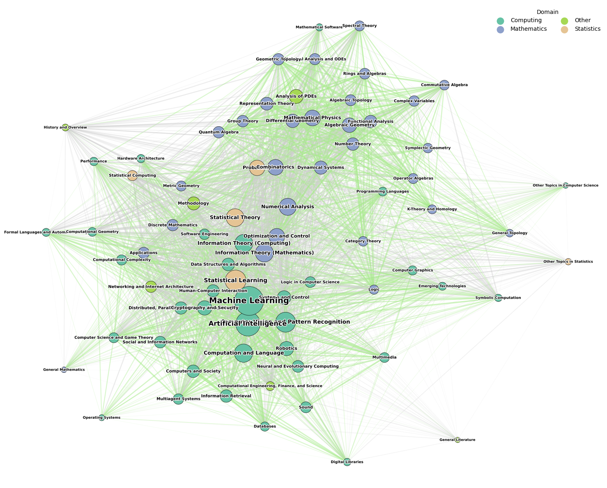

# arxiv-math-networks-graph
Mapping thematic gaps between Mathematics, Computing, and Statistics based on *arXiv* co-occurrence graphs.

## Content

| Directory | Description |
|-----------|-----------|
| `data/raw/`        | Original JSONs with weighted nodes & edges. |
| `data/processed/`  | Filtered versions (w ≥ 50) used in figures. |
| `notebooks/`       | `graph_analysis.ipynb` — end-to-end executable notebook. |
| `figures/`         | Article-ready 300 dpi PNGs. |
| `src/`             | Utility functions to (re)construct the graph and metrics. |

## 📊 Main figures



## How to reproduce

```bash
git clone https://github.com/<user>/arxiv-math-networks-2020-24.git
cd arxiv-math-networks-graph
conda env create -f environment.yml        # or pip install -r requirements.txt
conda activate math-net
jupyter lab notebooks/graph_analysis.ipynb
```

## Data

The JSON files in data/raw/ were generated from arXiv metadata extracted from "arXiv dataset" on Kaggle*. Each edge carries the weight "weight" = number of articles citing both subtopics.

*Note: You can find more information about the dataset on: https://www.kaggle.com/datasets/Cornell-University/arxiv/data

## License

Distributed under the MIT license — free to use for research and commercial purposes, as long as cited.

> Please cite this repository as:
>
> Vargas, J. & Co-authors. arxiv-math-networks-graph. GitHub, 2025.
